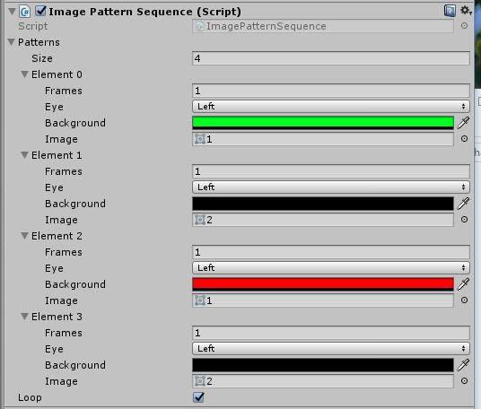

# Introduction

This project can show images (e.g. alpha channel .pngs) with different background colours per-eye for a specified number of frames. Steps to run:

1) Install Unity 2017.3.0 or higher (i tested on 2017.3.0f3).
2) Open the UnityProject folder in Unity
3) Open the scene in Assets/Mark/Scenes
4) With an Oculus Rift CV1 plugged in, hit play, and maximize the Game window. OR create a build and run it.

# Requirements

Tested on Unity 2017.3.0 using an Oculus Rift CV1.

# Notes / Potential Issues

## Is 90FPS / 90Hz always the case?

Ordinarily, a VR headset experience will render at the refresh rate of the headset e.g. 90FPS. However, if the system slows down (e.g. windows update kicks in), the frame rate may take a dip. When this happens, the frame may be displayed for longer than the ~1/90 seconds you assumed it would be visible for. The current implementation of this is the naive one (i.e. it just counts frames and doesn't take this into account). I've added a logging message in telling you how many seconds 90FPS rendered in for quick validation, but for it to operate correctly using this naive implementation you need to either a) in the Editor view, maximize the Game window during play b) make a Build for testing, otherwise the rendered framerate will not be 90FPS and the patterns won't display correctly.

If potential minor discrepancies matter for your project, here's a few things to consider:

1) In Update(), Time.deltaTime tells you how long it took to render the last frame. Instead of counting frames, you could count milliseconds of display time instead, and trigger transitions based on this. And regardless of whether you count frames or time to enact transitions between patterns, you could then log how long each pattern was displayed for, and categorise that for reporting e.g. pattern was shown for XX ms on average, with a SD of YY ms.

2) Different VR headsets have different behaviour when framerates drop e.g. Oculus will use [asynchronous spacewarp (ASW)](https://developer.oculus.com/documentation/pcsdk/latest/concepts/asynchronous-spacewarp/) whilst SteamVR will use [asynchronous re-projection](https://www.vrheads.com/what-asynchronous-reprojection-and-how-do-i-use-it) - basically both the same thing, repeating previous frames to fill in the gap. But if you want to disable them, you have to do so in the requisite SDK for the headset you are using. 

## Does Head movement matter here?

For this implementation, yes, unless you disable [Asynchronous TimeWarp (ATW)](https://developer.oculus.com/documentation/mobilesdk/latest/concepts/mobile-timewarp-overview/). If participants don't move their head around you'll be fine, but if they are going to move a bit, then you need to 1) disable ATW 2) perhaps even blit the image directly to the eye camera, depending on the discrepancy between the head-locked UI elements and the actual head orientation during movement. You'd need to test this out.

## How can I validate that each pattern is being rendered exactly for the number of frames specified?

I've done a quick validation, rendering at 60FPS on a monitor and using both Unity Recorder ( https://assetstore.unity.com/packages/essentials/beta-projects/recorder-94079 record each rendered frame) and the NVidia shadow play (record at 60FPS) and it looks like everything is working exactly as expected (e.g. if you display a pattern for 1 frame, it will only persist for one frame). But I'd certainly want to validate a bit more on a real VR headset, depending on how precise you have to be.
